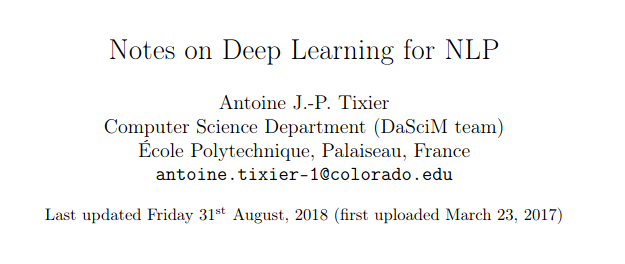

# CNN and RNN for NLP

 Este repositório foi criado para armazenar os arquivos referentes ao trabalho final da disciplina de Machine Learning do curso de mestrado em Matemática Aplicada da 
	<a href="https://emap.fgv.br/mestrado/modelagem-matematica">EMAp/FGV</a>.  

 

## O que aprendemos:

> - Como fazer _feature embedding_ e identificar os benefícios dessa representação na similaridade entre _features_.
> - Como aplicar CNNs e RNNs em tarefas de _Natural Language Processing_.
> - Diferenças entre CNNs e RNNs (vantagens e desvantagens de cada uma no contexto de NLP)

 

## Conteúdo da pasta:

> - **imdb:** base de dados com _reviews_ do IMDB (Internet Movie Database), encontrada neste [link](https://archive.ics.uci.edu/ml/datasets/Sentiment+Labelled+Sentences). 
> - **CNN_on_IMDB_dataset:** IPython notebook com um exemplo de aplicação de Redes Neurais Convolucionais (CNN) em uma tarefa de classificação binária (análise de sentimento) - buscou-se classificar diferentes _reviews_ em positivos ou negativos.  
> - **RNN_LSTM_GRU:** IPython notebook com exemplos de aplicação de Redes Neurais Recorrentes (RNN), _Long Short-Term Memory_ (LSTM) e _Gated Recurrent Unit_ (GRU) na mesma terefa de classificação binária. 
> - **presentation:** slides usados na apresentação. 

 

## Sobre o trabalho: 

O paper apresentado foi: 

que traz um _overview_ de aplicações de _Deep Neural Networks_ no contexto de NLP. Esse artigo pode ser lido na íntegra [aqui](https://arxiv.org/pdf/1808.09772.pdf). 

 

### Sobre os Dados: 

Os dados utilizados nas aplicações de CNN e RNN podem ser encontrados <a href="https://archive.ics.uci.edu/ml/datasets/Sentiment+Labelled+Sentences">neste link</a>. 

Conforme solicitado, segue a citação do paper que originou essa base de dados: "<b>From Group to Individual Labels using Deep Features', Kotzias et. al,. KDD 2015"</b>

 

### Sobre CNNs:

<i>Convolutional Neural Networks</i> são uma classe de redes neurais do tipo <i>feed-forward</i> que utiliza uma variação de perceptrons multicamadas. Suas principais características são:

- **invariância local:** a posição absoluta de _features_ na imagem, ou texto, não é relevante. Apenas suas posições relativas são importantes para compor padrões de alto nível

- **_compositionality_:** está associada à capacidade dessas redes reconhecerem padrões complexos de maneira hierárquica, combinando características elementares em padrões de alto nível. 

Esses modelos ganharam muita fama em aplicações de <i>Computer Vision</i> e, recentemente, têm ganhado mais atenção e obtido boa performance no campo de NLP.

#### Problemas de aplicação:

CNNs são eficazes em capturar informações de ordenamendo das <i>features</i>, mas estão limitadas a padrões locais de forma que padrões de longo alcance são ignorados. Tomando como exemplo uma aplicação de NLP, palavras que têm significado associado mas que aparecem muito distantes no texto não teriam similaridade captada apropriadamente por essa classe de modelos.

Para saber mais a respeito, vide os links presentes na seção `Outras Referências`. 

 

### Sobre RNNs:

Trata-se de uma forma específica das redes neurais em que as camadas escondidas (<i>Hidden Layers</i>)
    comunicam-se entre si, estabelecendo uma dimensão temporal de maneira tal que a atualização tanto do <i>feedforwad</i> quanto 
do <i>backpropagation</i> respeitam essa sequência da disposição interna da rede. 

Elas podem ser utilizadas tanto para 
modelagem e previsão de séries temporais, como é utilizada em sua grande maioria, mas também pode ser
aplicada a outros estudos em que a disposição dos elementos dos dados possuem certa influência sobre a previsão ou estudo da própria modelagem. 

#### Problemas de aplicação: 

Existem alguns problemas que podem surgir quando se faz o uso dessa técnica, prejudicando o processo de 
    aprendizado. Uma delas é o problema de <i>Vanishing Gradient</i> ou <i>Exploding Gradient</i>, que surge da retroalimentação das camadas 
    internas da rede, que pode ser longa, e assim a matriz de pesos quando possui valores pequenos, devido a multiplicação, pode
    ao final de uma época apresentar valores muito próximos a zero. O que equivalente pode ocorrer se a matriz possuir valores altos.

Algumas soluções viáveis para contornar este problema podem ser implementadas, como truncar o procedimento do backpropagation, aplicar penalidades ou estabelecer limites máximos ou mínimos para 
    a matriz de pesos. Além disso existem ainda formas de inicializar a matriz de pesos de forma conveniente. Outra forma seria a aplicação das conhecidas <i>Long Short-Term Memory Networks</i> (LSTM). Para estudos mais aprofundados do funcionamento das LSTMs, sugere-se a leitura do artigo citado anteriormente e dos links disponibilizados na próxima seção.

 

### Outras referências: 

- Um bom _overview_ sobre CNNs pode ser encontrado em:
	
<a href="https://towardsdatascience.com/a-comprehensive-guide-to-convolutional-neural-networks-the-eli5-way-3bd2b1164a53"> https://towardsdatascience.com/a-comprehensive-guide-to-convolutional-neural-networks-the-eli5-way-3bd2b1164a53</a>

- Exemplo de aplicação de CNN: 
	

- Um excelente link para um aprendizado mais robusto de RNN está em: 
	
<a href="https://colah.github.io/posts/2015-08-Understanding-LSTMs/"> https://colah.github.io/posts/2015-08-Understanding-LSTMs/</a>

- Exemplos de aplicação em NLP:
	
<a href="https://medium.com/dair-ai/deep-learning-for-nlp-an-overview-of-recent-trends-d0d8f40a776d"> https://medium.com/dair-ai/deep-learning-for-nlp-an-overview-of-recent-trends-d0d8f40a776d</a>

	
<a href="https://colah.github.io/posts/2015-08-Understanding-LSTMs/"> https://colah.github.io/posts/2015-08-Understanding-LSTMs/</a>

	
<a href="https://towardsdatascience.com/natural-language-processing-from-basics-to-using-rnn-and-lstm-ef6779e4ae66">https://towardsdatascience.com/natural-language-processing-from-basics-to-using-rnn-and-lstm-ef6779e4ae66</a>

 

Registramos aqui nossos agradecimentos aos autores que disponibilizaram publicamente o material de excelente qualidade nos links acima.
    

 

---

**Autores:** 

- Gabriel Novais (https://github.com/NovaisGabriel)
- Franklin Oliveira (https://github.com/Franklin-oliveira)

---